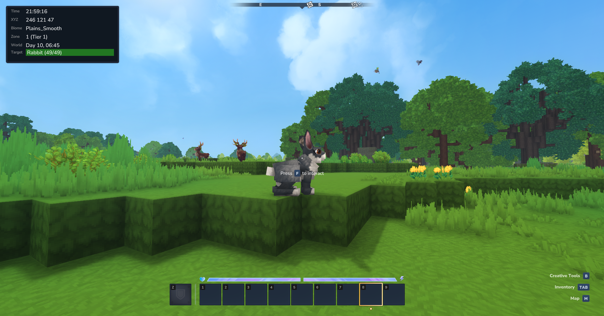
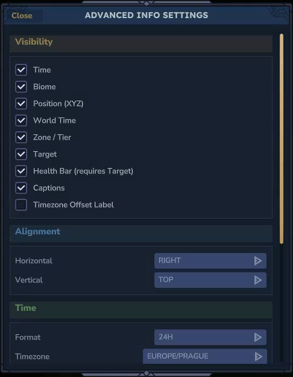
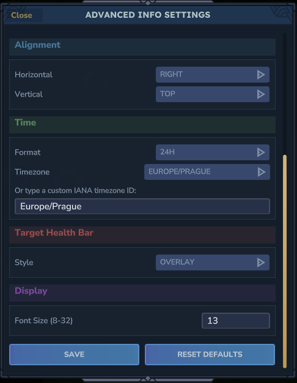

# AdvancedInfo

A Hytale server plugin that displays a configurable information HUD with real-time data about the player's surroundings and current target.

If the [MultipleHUD](https://www.curseforge.com/hytale/mods/multiplehud) mod is present, AdvancedInfo integrates with it automatically, allowing it to coexist alongside other mods that use a custom HUD slot.

## HUD Panels

- **Time** - the server's current wall-clock time.
- **Biome** - the name of the biome the player is standing in.
- **Position** - the player's current XYZ coordinates.
- **World Time** - the in-game world time.
- **Zone** - the zone and tier the player is currently in.
- **Target** - the name and health of the entity or block the player is looking at, with an optional health bar.
- **Captions** - labels shown next to each HUD value.
- **Timezone Offset** - the UTC offset of the active timezone shown next to the time (hidden by default; requires a timezone to be set).

## Target Health Bar

- Two display styles: `below` (bar underneath the name) and `overlay` (name rendered on top of the bar).
- Health-gradient color: transitions from red through orange and yellow to green based on remaining health.
- Can be toggled independently from the target panel.

## Settings UI

Run `/ai ui` to open the in-game settings page. It provides a scrollable interface to configure all options without typing commands:

- **Visibility** - toggle each HUD panel on or off individually.
- **Alignment** - choose horizontal (`left`, `center`, `right`) and vertical (`top`, `bottom`) position.
- **Time** - switch between 12-hour and 24-hour format, select a timezone from a dropdown, or type any IANA timezone ID directly.
- **Target Health Bar** - choose the display style (`overlay` or `below`).
- **Display** - set the font size (8-32).

Use **SAVE** to apply and close, **RESET DEFAULTS** to restore all settings, or **Close** to discard unsaved changes.

## Commands

All commands use `/advanced-info` or the alias `/ai`.

| Command | Description |
|---|---|
| `/ai ui` | Open the in-game settings UI. |
| `/ai show <element>` | Show a specific HUD element. |
| `/ai hide <element>` | Hide a specific HUD element. |
| `/ai show captions` | Show all HUD element captions. |
| `/ai hide captions` | Hide all HUD element captions. |
| `/ai show all` | Show all HUD elements. |
| `/ai hide all` | Hide all HUD elements. |
| `/ai time <12\|24>` | Set the time display format to 12-hour or 24-hour. |
| `/ai timezone <zone>` | Set the timezone for the time display using an IANA zone ID (e.g. `Europe/Prague`, `America/New_York`, `UTC`). |
| `/ai align <h> <v>` | Set both horizontal and vertical alignment at once. |
| `/ai halign <left\|center\|right>` | Set the horizontal alignment of the HUD panel. |
| `/ai valign <top\|bottom>` | Set the vertical alignment of the HUD panel. |
| `/ai healthbar <below\|overlay>` | Set the health bar display style. |
| `/ai font <size>` | Set the font size of the HUD labels (range: 8-32, default: 18). |
| `/ai status` | Print the current visibility and configuration of all HUD elements. |
| `/ai reset` | Reset all settings to their default values. |

Available elements for `show`/`hide`: `time`, `biome`, `position`, `worldtime`, `zone`, `target`, `healthbar`, `timezone`.

## Settings

All settings are saved per-player and persist across sessions. Settings introduced in future versions are automatically migrated with sensible defaults.

## Changelog

See [CHANGELOG.md](CHANGELOG.md) for the full version history.
